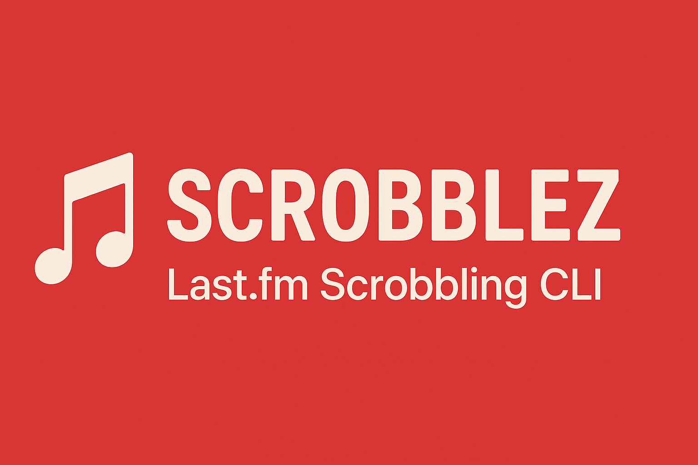

<p align="center">
  
</p>

# 🎵 Scrobblez - Last.fm Scrobbling CLI

This is a **TypeScript CLI application** that allows you to quickly and efficiently scrobble tracks to Last.fm.  
Made with ❤️, TypeScript, and a passion for music tracking.

---

## ✨ Features

* 🔐 **Secure Authentication** — Uses Last.fm's official authentication flow
* 🎧 **Bulk Scrobbling** — Add multiple scrobbles at once
* 📊 **Progress Tracking** — Visual feedback on scrobbling progress
* 🔄 **Flexible Input** — Enter tracks as "song - artist" or separately
* 🚀 **Easy to Use** — Simple command-line interface

---

## 🛠️ Technologies

* [TypeScript](https://www.typescriptlang.org/) — Strongly typed JavaScript
* [Node.js](https://nodejs.org/) — JavaScript runtime
* [node-fetch](https://github.com/node-fetch/node-fetch) — For making API requests
* [open](https://github.com/sindresorhus/open) — For opening browser windows
* [dotenv](https://github.com/motdotla/dotenv) — For managing environment variables
* [Last.fm API](https://www.last.fm/api) — For scrobbling tracks

---

## 📋 Installation & Setup

1. Clone the repo:
   ```bash
   git clone https://github.com/mwistro/Scrobblez.git
   cd Scrobblez
   ```

2. Install dependencies:
   ```bash
   npm install
   ```

3. Create a `.env` file in the root(dist) folder with your Last.fm API credentials:
   ```
   LASTFM_API_KEY=your_api_key_here
   LASTFM_SHARED_SECRET=your_shared_secret_here
   ```

4. Build the TypeScript code:
   ```bash
   npm run build
   # or
   npx tsc
   ```

5. Run the application:
   ```bash
   node dist/main.js
   ```

---

## 📱 Usage

When you run the application, it will:

1. Open your browser for Last.fm authentication
2. Ask you to authorize the application
3. Prompt you to enter track information:
   ```
   📝 Enter the song name: Shape of You - Ed Sheeran
   ```
   or
   ```
   📝 Enter the song name: Shape of You
   📝 Enter the artist name: Ed Sheeran
   ```

4. Ask for the number of scrobbles:
   ```
   📊 How many scrobbles would you like? (Recommended daily maximum: 2000): 10
   ```

5. Show progress as it scrobbles:
   ```
   🎵 Starting scrobble of "Shape of You" by "Ed Sheeran"
   📊 Total scrobbles to perform: 10

   🎧 Progress: 10/10 scrobbles (100%)

   ✅ Scrobble completed successfully! 10 scrobbles of "Shape of You" by "Ed Sheeran" have been logged.
   ```

---

## 📝 Notes

This project was built as a way to practice TypeScript and interact with the Last.fm API.  
There may still be bugs or things to improve — but it was built with care and a passion for music tracking.

Feel free to use it, suggest improvements, or open a pull request!  
Let's make music tracking better together 🎵💻

---

## 📄 License

This project is licensed under the MIT License.
